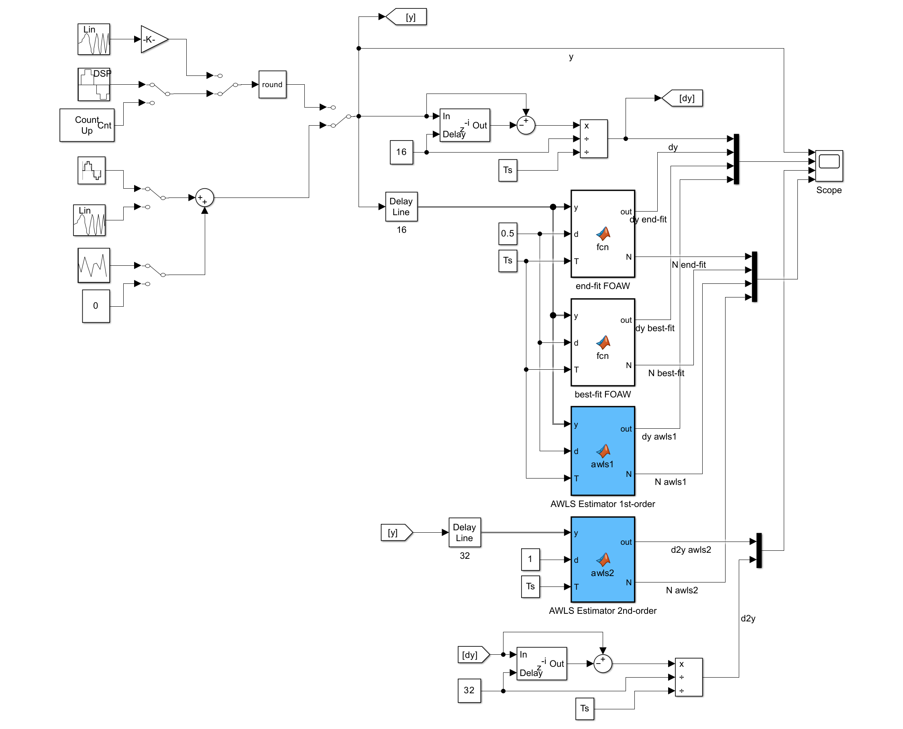
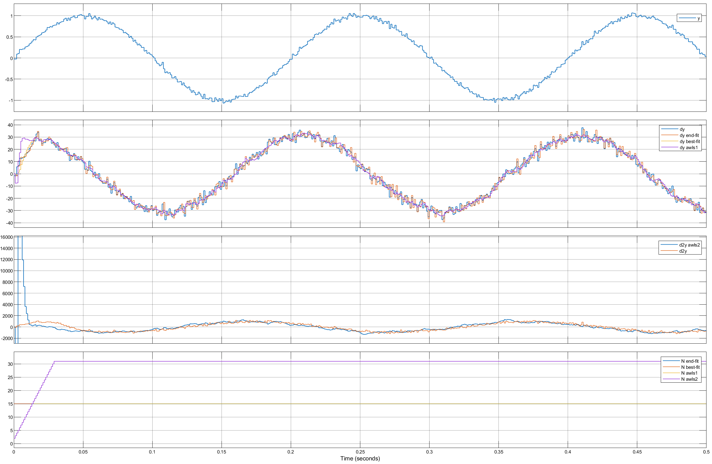

Adaptive Window Least-Squares Estimators
========================================

- These estimators provide first and second order derivatives of the incoming data.
- The implementation makes use of a least-squares approach applied to a timeboxed adaptable window.

ℹ️ The implementation is based on the paper:
- [Discrete-time adaptive windowing for velocity estimation](https://ieeexplore.ieee.org/document/880606)

### Test
You can run the associated test that allows to compare the estimated derivatives against other solutions.

