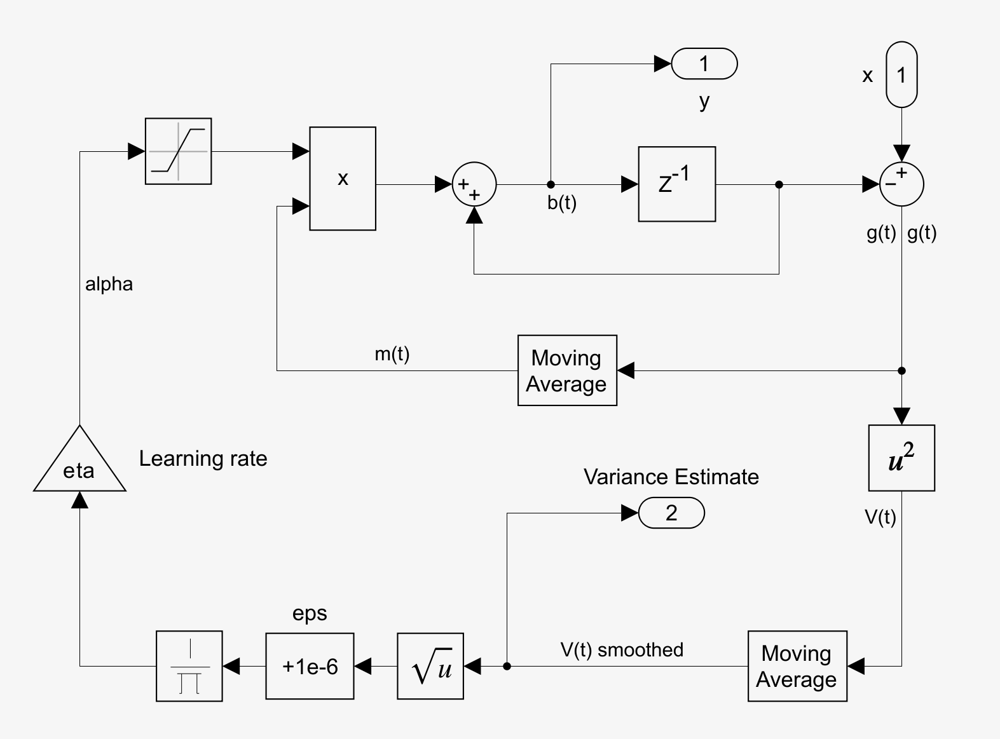
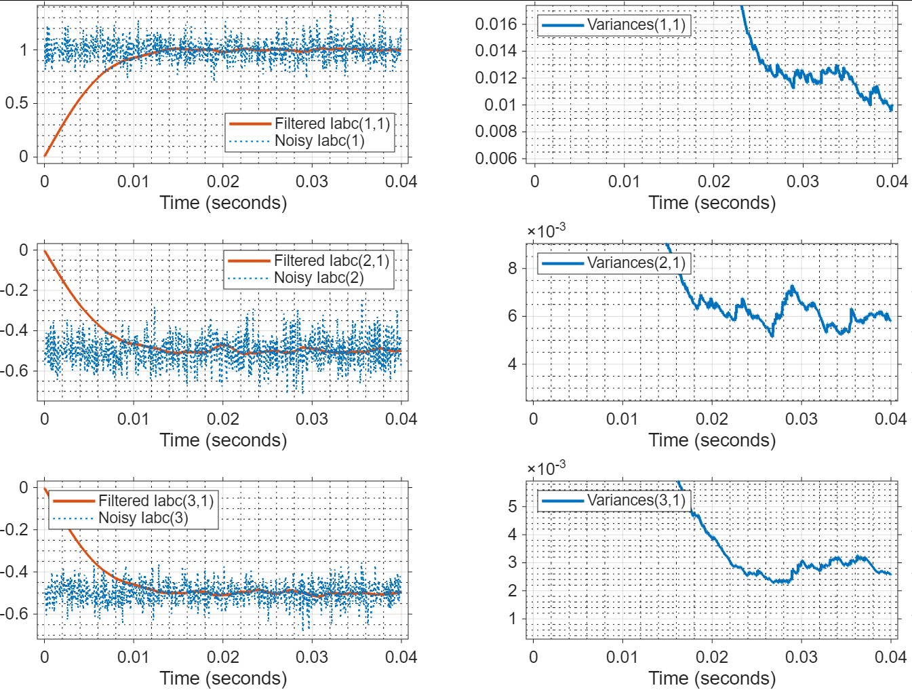

Adaptive Exponential Smoother
============================

- This discrete filter estimates the variance of a signal online in order to smooth it out.
- The user just has to set up a learning rate, a momentum rate, and an initial variance estimate.
- The block is ready for code generation. 

## Algorithm

Starting off with $b(t-1)$ as the bias estimate at time t -1, and $x(t)$ as the input signal, we do

$$
g_t = b_{t-1} - x_t
$$

a measure of deviation between our estimate and the signal. We square it to find a variance estimate and then smooth it with $\beta = 0.99$

$$
V_t = \beta V_{t-1} + (1 - \beta) g^2_t
$$

This variance is used to compute $\alpha$, which is the adaptive factor of the exponential smoother. We do so in this manner:

$$
\alpha = \dfrac{\eta}{\sqrt{V_t} + \epsilon}
$$

$\eta$ is the learning rate (e.g 0.002) and $\epsilon$ is a regularization value, e.g. 1e-6 .

We also have a "momentum" component that helps us direct more smoothly the gradient direction, using a parameter gamma ( e.g. 0.95):

$$
m_t = \gamma m_{t-1} + (1 - \gamma) g_t
$$

The bias at time t is finally computed as 

$$
b_t = b_{t-1} + \alpha \cdot m_t
$$

### Test
You can run the associated test in `tests/test_exponential_adaptive_smoother.slx`, showing the following result. We see how the variance converges to the set values, while the original signal is smoothed out.

