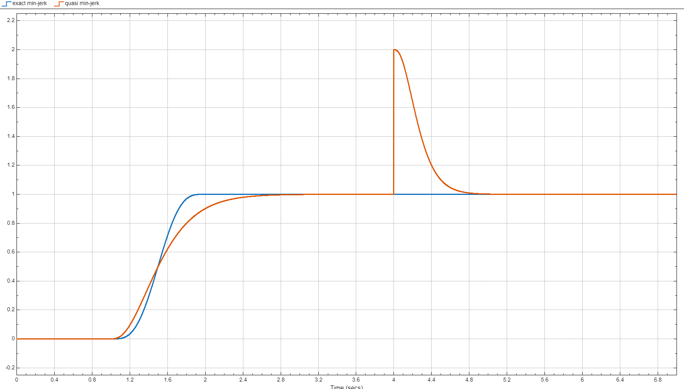

Discrete Minimum Jerk Filter
============================

- This discrete filter implements a quasi minimum jerk smoother.
- Remarkably, the filter's rise-time can be adjusted at runtime.
- The block is ready for code generation. 

ℹ️ The implementation is based on the paper:
- [An experimental evaluation of a novel minimum-jerk cartesian controller for humanoid robots](https://ieeexplore.ieee.org/document/5650851)

### Test
You can run the associated test that allows to compare the filter output with the exact minimum jerk reference trajectory.

At the mid instant of the time window, we show how the filter can be reset to a specified output.

