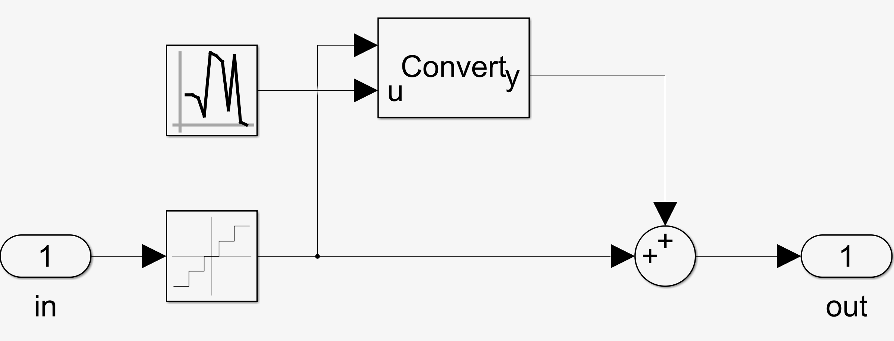
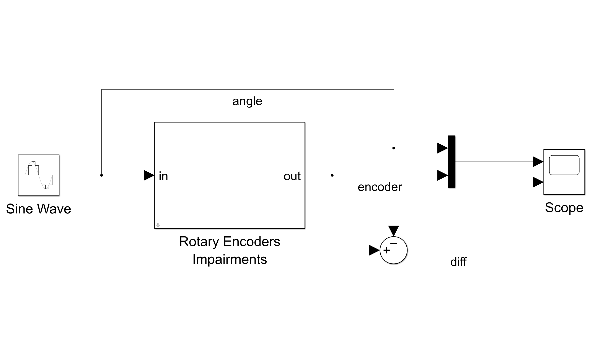
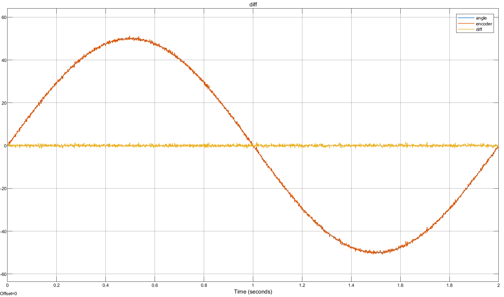

Rotary Encoders Impairments
===========================

- The block simulates the impairments underlying the rotary encoders readouts.
- In particular, the block simulates the effects of quantization and noise.
- The block enforces the input and output signals units as degrees.

### Test
You can run the associated test that allows to evaluate the effect of quantization and noise on a sinusoidal signal.

