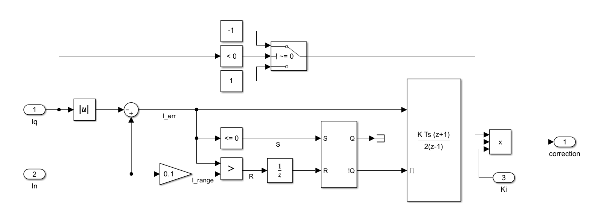
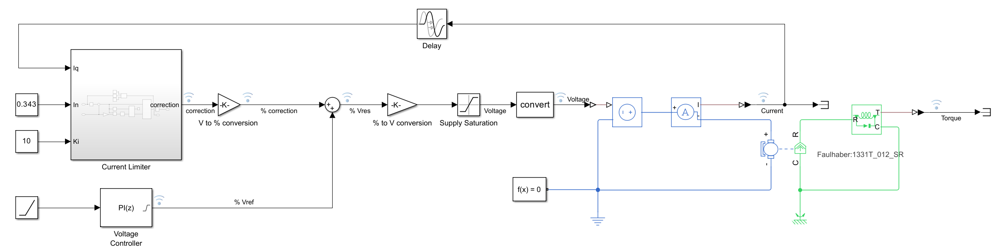
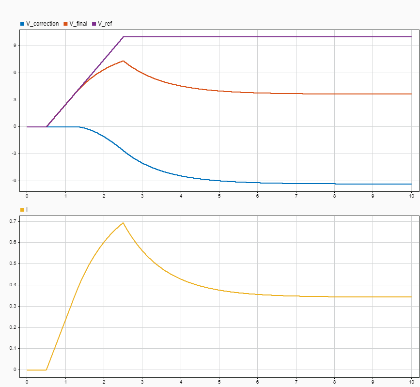

Current Limiter
========================

- This component implements the Simulink model of a current limiter that prevents the motor from operating too long at current values above its rated value, thus preventing it from burning out.
- When $$| I_q |$$ > $$I_n$$, the integral, responsible of the correction, produces a negative corrective action and gets disabled when $$I_n$$ - $$| I_q |$$ > 0.1 $$\cdot$$ $$I_n$$.

### Test

- The attached test implements the current limiter in the voltage control of a Faulhaber 1331T 012 SR DC motor.
- The results show the effectiveness of the component in maintaining the motor at nominal condition for prolonged operation requests.

  
