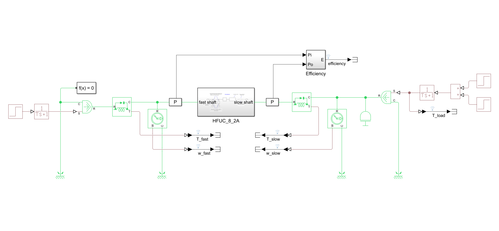
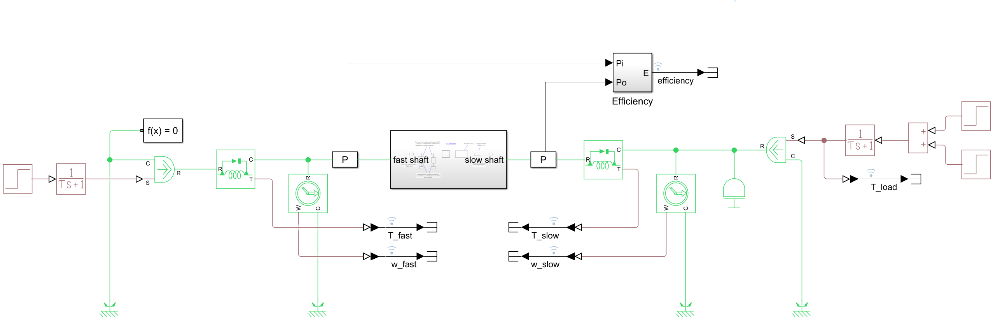
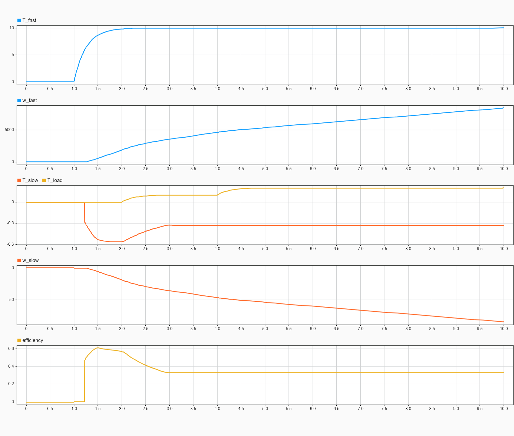

HFUC_8_2A Harmonic Drive
========================

- This component implements the Simscape model of the harmonic drive HFUC_8_2A.
- Nonlinearities are linked to the corresponding datasheet tables.

### Test
You can run the associated test that allows to log and plot the relevant quantities: torque, velocities, efficiency.

